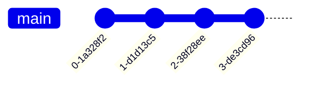
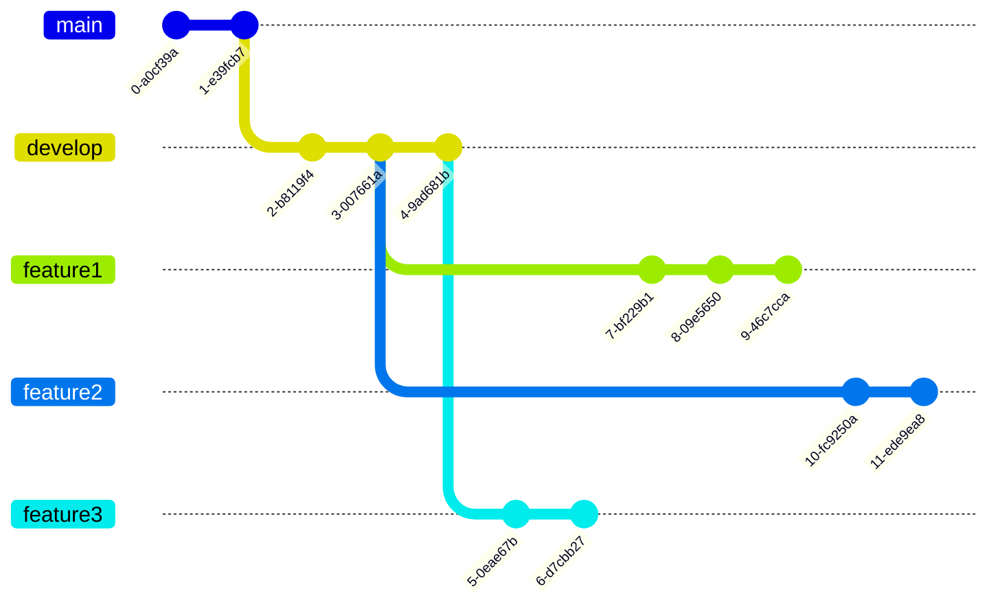

# Branches and commit

## One branch with commits

```mermaid
gitGraph
   commit
   commit
   commit
   commit
```

## Several branches

```mermaid
gitGraph
   commit
   commit
   branch develop
   checkout develop
   commit
   commit
   branch feature1
   branch feature2
   checkout develop
   commit
   branch feature3
   commit
   commit
   checkout feature1
   commit
   commit
   commit
   checkout feature2
   commit
   commit
```