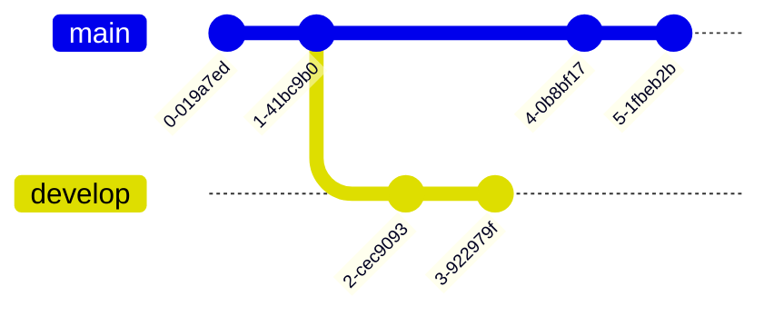
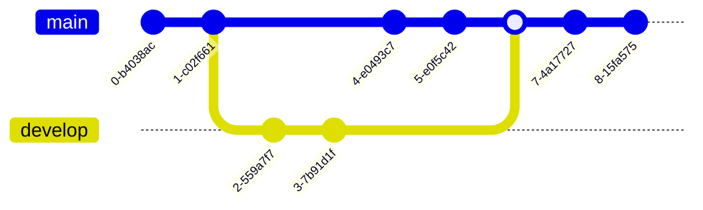

# Merging branches

## Initial situation

```mermaid
gitGraph
   commit
   commit
   branch develop
   checkout develop
   commit
   commit
   checkout main
   commit
   commit
```

## After merging develop into main

```mermaid
gitGraph
   commit
   commit
   branch develop
   checkout develop
   commit
   commit
   checkout main
   commit
   commit
   merge develop
   commit
   commit
```
See the "Merge commit" that was created during the merge.