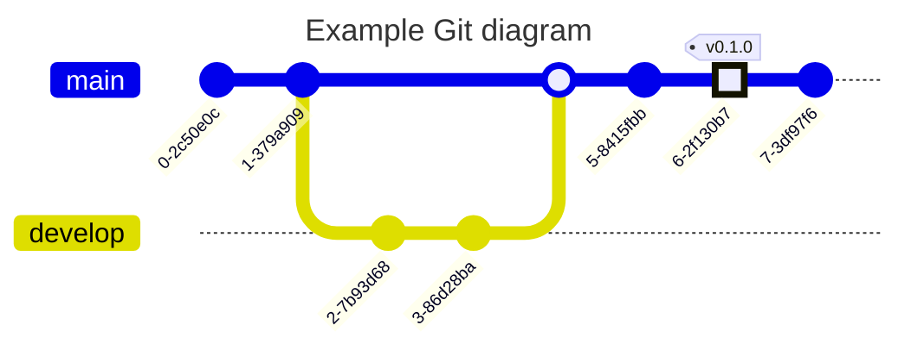

# Trainings on Git and GitHub

## Mermaid documentation

- [Mermaid live editor](https://mermaid.live/)
- [Gitgraph diagrams](https://mermaid.js.org/syntax/gitgraph.html)

## Mermaid example diagram

