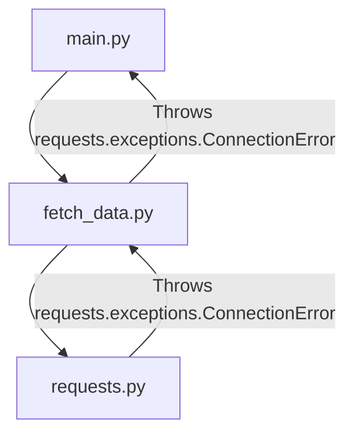
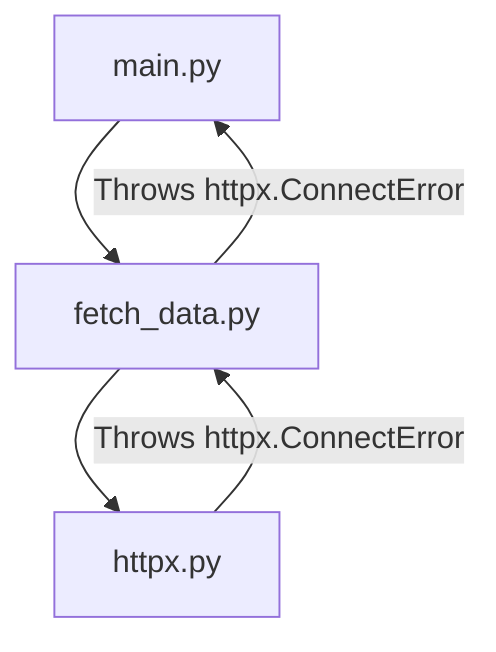
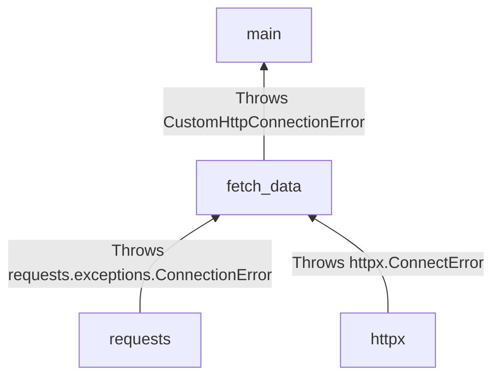

Initial

```mermaid
graph TB;
    main[main.py] --> fetch_data[fetch_data.py];
    fetch_data --> requests[requests.py];
    requests -->|Throws requests.exceptions.ConnectionError| fetch_data;
    fetch_data -->|Throws requests.exceptions.ConnectionError| main;
```

Hard to extend. Ex, we have to change the main

```mermaid
graph TB;
    main[main.py] --> fetch_data[fetch_data.py];
    fetch_data --> httpx[httpx.py];
    httpx -->|Throws httpx.ConnectError| fetch_data;
    fetch_data -->|Throws httpx.ConnectError| main;
```

If we keep exceptions at their level:

```mermaid
graph BT;
    fetch_data -->|Throws CustomHttpConnectionError| main;
    requests -->|Throws requests.exceptions.ConnectionError| fetch_data;
    httpx -->|Throws httpx.ConnectError| fetch_data;
```