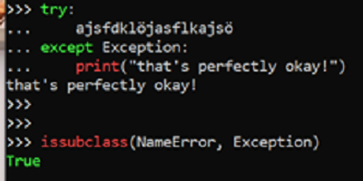

# How to improve the design of you software?

---
### Error handling

---
###### Error handling :red_circle:

```Python
try:
    do_this()
    do_this()
    do_this()
    do_this_difficult_thing()
except:
    print("An error happened")
```

---

###### Error handling :white_check_mark:

```Python
class CustomException(Exception):
    """Custom exception that is raised when this happens"""

    def __init__(self, thing: str, msg: str | None):
        self.thing = thing
        self.msg = msg or "default message"
    
    def __str__(self) -> str:
        return self.msg

do_this()
do_this()
do_this()
try:
    do_this_difficult_thing()

except:
    print("An error happened")
```

---
###### Error handling :red_circle:
```Python
def main():
    try:
        my_var = float(input("Please enter a number: "))
        print(f"You entered {my_var}")

        whaterver
    except:
        pass
```

---


---
###### Error handling :white_check_mark:
```Python
    try:
        my_var = float(input("Please enter a number: "))
        print(f"You entered {my_var}")

    except ValueError:
        print("Please enter a valid number!")
```

---
###### Error handling
Keep exceptions at their level
See mermaid diagrams

---
###### Error handling
Keep exceptions at their level
```Python
class VacationDaysShortageError(Exception):
    """Custom error that is raised when not enough vacation days are available."""

    def __init__(self, requested_days: int, remaining_days: int, message: str) -> None:
        self.requested_days = requested_days
        self.remaining_days = remaining_days
        self.message = message
        super().__init__(message)
```

---
###### Error handling takeaways
- Don't silence exception
- Catch only specific exceptions
- Raise meaningful exceptions
- Use exception at their appropriate level, don't push low-level exception all the way to the top

---
## Quiz:
###### What is the issue?
###### How can we fix it?

---
<!--
Issue: Naming according to process
Fix: name according to what the function do
-->
```Python
def first_step() -> str:
    return input("Enter your name: ")


def second_step() -> int:
    while True:
        line = input("Enter your age: ")
        try:
            return int(line)
        except ValueError:
            print("That's not a number! Try again.")


def final_step(name: str, age: int) -> None:
    young_cutoff = 30
    if age <= young_cutoff:
        print(f"{name}, you are young.")
    else:
        print(f"{name}, you're old!")


def main():
    name = first_step()
    age = second_step()
    final_step(name, age)
```

---
<!--
Issue: deep nesting
Fix: simplify conditions and use guard clauses
-->
```Python
def place_a_guess(guesses: int, answer: int, player_name: str) -> bool:
    if guesses > 0:
        print(f"Player {player_name} has {guesses} guesses left.")

        guess = int(input("Guess a number between 0 and 100: "))
        if 0 < guess 100:
            if guess == answer:
                print("You win!")
                return True
            else:
                if guess < answer:
                    print("Too low!")
                else:
                    print("Too high!")
                return False
        else:
            # invalid input from user
            raise ValueError(f"Invalid guess {guess}! Must be between 0 and 100")
    else:
        return False
```

---
<!--
Issue: using inheritance to configure objects
Fix: use composition instead of inheritance
-->
```Python
@dataclass
class Enemy:
    strength: int
    dexterity: int
    intelligence: int
    health: int


class Zombie(Enemy):
    def __init__(self):
        super().__init__(strength=30, dexterity=10, intelligence=1, health=100)


class EvilOverlord(Enemy):
    def __init__(self):
        super().__init__(strength=10, dexterity=10, intelligence=10, health=100)


def main() -> None:
    zombie = Zombie()
    print(zombie)
```

---
```Python
@dataclass
class Enemy:
    strength: int
    dexterity: int
    intelligence: int
    health: int


def create_zombie() -> Enemy:
    return Enemy(strength=30, dexterity=10, intelligence=1, health=100)


def create_evil_overlord() -> Enemy:
    return Enemy(strength=10, dexterity=10, intelligence=10, health=100)
```

---
```Python
class EnemyKind(Enum):
    ZOMBIE = "Zombie"
    EVIL_OVERLORD = "Evil overlord"
    ...

ENEMY_STRENGTH: dict[EnemyKind, int]: {
    EnemyKind.ZOMBIE: 30,
    EnemyKind.EVIL_OVERLORD: 10,
}
ENEMY_DEXTERITY: dict[EnemyKind, int]: {
    EnemyKind.ZOMBIE: 10,
    EnemyKind.EVIL_OVERLORD: 10,
}


@dataclass
class Enemy:
    kind: EnemyKind

    @property
    def strength(self) -> int:
        return ENEMY_STRENGTH[self.kind]
    
    @property
    def dexterity(self) -> int:
        return ENEMY_DEXTERITY[self.kind]

    ...
```

---
<!--
Issue: creating and using an object in the same place
Fix: use dependency injection
-->
```Python
PRICES = {
    "burger": 10_00,
    "fries": 5_00,
    "drink": 2_00,
    "salad": 15_00,
}


def order_food(items: list[str]) -> None:
    total = sum(PRICES[item] for item in items)
    print(f"Your order is ${total/100:.2f}.")
    payment_handler = StripePaymentHandler()
    payment_handler.handle_payment(total)
    print("Thanks for your business!")


def main() -> None:
    order_food(["burger", "fries", "drink"])
```

---
```Python
class StripePaymentHandler:
    def handle_payment(self, amount: int) -> None:
        print(f"Charging ${amount/100:.2f} using Stripe")


PRICES = {
    "burger": 10_00,
    "fries": 5_00,
    ...
}


def order_food(items: list[str], payment_handler: StripePaymentHandler) -> None:
    total = sum(PRICES[item] for item in items)
    print(f"Your order is ${total/100:.2f}.")
    payment_handler.handle_payment(total)
    print("Thanks for your business!")


def main() -> None:
    stripe_payment_handler = StripePaymentHandler()
    order_food(["burger", "salad", "drink"], stripe_payment_handler)
```

---
<!-- Using dependency inversion too -->
```Python
class PaymentHandler(Protocol):
    def handle_payment(self, amount: int) -> None:
        """Handle the payment."""


class StripePaymentHandler:
    def handle_payment(self, amount: int) -> None:
        print(f"Charging ${amount/100:.2f} using Stripe")


def order_food(items: list[str], payment_handler: PaymentHandler) -> None:
    total = sum(PRICES[item] for item in items)
    print(f"Your order is ${total/100:.2f}.")
    payment_handler.handle_payment(total)
    print("Thanks for your business!")


def main() -> None:
    stripe_payment_handler = StripePaymentHandler()
    order_food(["burger", "salad", "drink"], stripe_payment_handler)
```

---
<!--
Issue: import *
Fix: remove wildcard and import only what you need
-->
```Python
from random import *
from string import *


def generate_vehicle_id(length: int = 8) -> str:
    return "".join(choices(ascii_uppercase, k=length))

def generate_vehicle_license(_id: str) -> str:
    id_part = _id[:2]
    number_part = "".join(choices(digits, k=2))
    letter_part = "".join(choices(ascii_uppercase, k=2))
    return f"{id_part}-{number_part}-{letter_part}"
```

---
<!--
Issue: unnecessary complexity
Fix: simplify by choosing a more appropriate data structure
-->
```Python
POSITIVE_WORDS: list[str] = [
    "awesome", "great", "super", "fun",
    "entertaining", "cool", "adventurous", "nice",
]

NEGATIVE_WORDS: list[str] = [
    "boring", "annoying", "useless", "bad",
    "terrible", "gross", "stupid", "hate",
]


def detect_positive(review: str) -> bool:
    words = review.split()
    count_positive = 0
    count_negative = 0
    for word in words:
        if word in POSITIVE_WORDS:
            count_positive += 1
        if word in NEGATIVE_WORDS:
            count_negative += 1
    return count_positive >= count_negative


def main():
    good_review = "This movie is awesome!"
    print(detect_positive(good_review))
    bad_review = "I hate this movie"
    print(detect_positive(bad_review))
```

---
```Python
POSITIVE_WORDS: set[str] = {
    "awesome", "great", "super", "fun",
    "entertaining", "cool", "adventurous", "nice",
}

NEGATIVE_WORDS: set[str] = {
    "boring", "annoying", "useless", "bad",
    "terrible", "gross", "stupid", "hate",
}


def detect_positive(review: str) -> bool:
    words = review.split()
    count_positive = len(POSITIVE_WORDS.intersection(words))
    count_negative = len(NEGATIVE_WORDS.intersection(words))
    return count_positive >= count_negative


def main():
    good_review = "This movie is awesome!"
    print(detect_positive(good_review))
    bad_review = "I hate this movie"
    print(detect_positive(bad_review))
```

---
<!--
Issue: unnecessary complexity
Fix: simplify by choosing a more appropriate data structure
-->
```Python
@dataclass
class Customer:
    name: str
    email: str
    active: bool

class CustomerManager:
    customers: list[Customer] = []

    def add_customer(self, name: str, email: str, active: bool = True):
        self.customers.append(Customer(name, email, active))


    def find_customer_by_email(self, email: str) -> Customer:
        for customer in self.customers:
            if customer.email == email:
                return customer
        raise ValueError(f"No customer with email {email}")


def main():
    add_customer("Sarah", "sarah@trconsulting.com", False)
    add_customer("Tim", "tim@timsdogclub.com")
    add_customer("Chelsey", "chelsey@examtraining.org")

    print(find_by_email("tim@timsdogclub.com"))
```

---
```Python
@dataclass
class Customer:
    name: str
    email: str
    active: bool


class CustomerManager:
    customers: dict[str, Customer] = {}

    def add_customer(self, name: str, email: str, active: bool = True):
        self.customers[email] = Customer(name, email, active)


    def find_customer_by_email(email: str) -> Customer:
        return self.customers[email]


def main():
    add_customer("Sarah", "sarah@trconsulting.com", False)
    add_customer("Tim", "tim@timsdogclub.com")
    add_customer("Chelsey", "chelsey@examtraining.org")

    print(find_by_email("tim@timsdogclub.com"))
```

---
<!--
Issue: too large try-block
Fix: put in the try block only the line that might raise an error
-->
```Python
def place_a_guess(answer: int) -> bool:
    while True:
        try:
            guess = int(input("Guess a number: "))

            if guess == answer:
                print("You win!")
            elif guess < answer:
                print("Too low!")
            else:
                print("Too high!")

            return guess == answer
        except ValueError:
            print("That's not a number!")
```

---
<!--
Issue: types not precise enough
Fix: use a type which is more precise and that does not allow for mistakes/errors.
-->
```Python
@dataclass
class Employee:
    name: str
    role: str


def main() -> None:
    louis = Employee(name="Louis", role="staff")
    print(louis)
    sarah = Employee(name="Sarah", role="ceo")
    print(sarah)
    john = Employee(name="John", role="spy")
    print(sarah)
```

---
```Python
class Role(Enum):
    STAFF = "staff"
    CEO = "ceo"
    ...

@dataclass
class Employee:
    name: str
    role: Role


def main() -> None:
    louis = Employee(name="Louis", role=Role.STAFF)
    print(louis)
    sarah = Employee(name="Sarah", role=Role.CEO)
    print(sarah)
```

---
<!--
Issue: inappropriate intimacy
Fix: pass only the geoLocation object to the function
-->
```Python
@dataclass
class Geolocation:
    id: int
    street: str
    postal_code: str
    city: str
    province: str
    latitude: float
    longitude: float


@dataclass
class Location:
    id: int
    message_id: str
    raw_data: str
    date: datetime
    priority: int
    geolocation: list[Geolocation] = field(default_factory=list)


def generate_breadcrumbs(location: Location) -> dict[str, str]:
    breadcrumbs: dict[str, str] = {}
    main_url = "https://myapi.com"
    if location.geolocation[0]:
        if location.geolocation[0].postal_code:
            breadcrumbs[
                "postal_code_url"
            ] = f"{main_url}/postal_code/{location.geolocation[0].postal_code}/"
        if location.geolocation[0].city:
            city_slug = location.geolocation[0].city.lower().replace(" ", "-")
            breadcrumbs["city_url"] = f"{main_url}/region/{city_slug}/"
        if location.geolocation[0].province:
            breadcrumbs[
                "province_url"
            ] = f"{main_url}/region/province/{location.geolocation[0].province.lower()}/"
    return breadcrumbs
```

---
```Python
@dataclass
class Geolocation:
    id: int
    street: str
    postal_code: str
    city: str
    province: str
    latitude: float
    longitude: float


@dataclass
class Location:
    id: int
    message_id: str
    raw_data: str
    date: datetime
    priority: int
    geolocation: list[Geolocation] = field(default_factory=list)


def generate_breadcrumbs(geolocation: Geolocation) -> dict[str, str]:
    breadcrumbs: dict[str, str] = {}
    main_url = "https://myapi.com"
    if geolocation.postal_code:
        breadcrumbs[
            "postal_code_url"
        ] = f"{main_url}/postal_code/{geolocation.postal_code}/"
    if geolocation.city:
        city_slug = geolocation.city.lower().replace(" ", "-")
        breadcrumbs["city_url"] = f"{main_url}/region/{city_slug}/"
    if geolocation.province:
        breadcrumbs[
            "province_url"
        ] = f"{main_url}/region/province/{geolocation.province.lower()}/"
    return breadcrumbs
```
